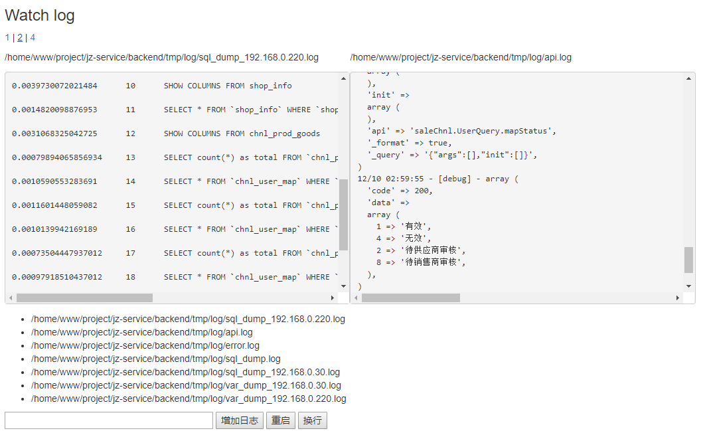

# 概述

用来监听服务器日志文件的变化, web版多文件同屏的 tail -f file效果,  
主要用来像我一样喜欢开发调试基于日志文件



注意: 可以增加任何文件监听, 可以点击选择想要监听的文件，为了您的安全请用于测试环境下运行, 或是自行增加防火墙规则安全访问

## install

```
composer install scalpel/watch-log:*
```

## config

创建配置文件设置相关参数, 配置logs监听多个日志文件, 

使用 --config configFilePath 设置配置文件路径,  
默认配置文件 project_root/config-watchLog.php

#### 简单配置：
```
<?php

return [
    'server' => '0.0.0.0',
    'port' => 9504,
    'logs' => [
        __DIR__ . '/tmp/test.log'
    ]
];
```

#### DirectoryIterator类自动遍历日志目录：

```
$opts = getopt("p");
$isPre = false;
if (isset($opts['p'])) {
    $isPre = true;
}

$logs = [];
if ($isPre) {
    $port = 9506;
    $dir = new DirectoryIterator(dirname(__DIR__) . "/tmp/log/");
} else {
    $port = 9505;
    $dir = new DirectoryIterator(__DIR__ . "/tmp/log/");
}

foreach ($dir as $file) {
    if (!$file->isDot() && $file->isFile() && strpos($file->getFilename(), '.') !== 0) {
        $logs[] = $file->getPathname();
    }
}

/*
 eg:   [
            'server' => '127.0.0.1',
            'port' => 9505,
            'logs' => [
                '/mnt/d/testComposer/tmp/log/error.log',
                '/mnt/d/testComposer/tmp/log/sql.log'
            ]
        ];
*/
return [
    'server' => '127.0.0.1',
    'port' => $port,
    'logs' => $logs
];
```

## run

```
php vendor/bin/WatchLog.php -v
```

## help
php vendor/bin/WatchLog.php -h

```
php WatchLog.php [options]

Options:
    -h, print this message
    -v, debug mode
    
    -d, run as a daemonize mode
    -a <action>, 
        stop: stop the server 
        restart: restart the server
    
    --config value, config file path, 
        default: project_root/config-watchLog.php

```


## use

http://your_server:port    （如:http://127.0.0.1:9505/）
